# 服务器梗的作用

在 Vanora Dynamo，梗不只是图一乐的笑料，更是把一群人粘在一起的「社交胶水」。
它们把散落在大半年里的名场面、口头禅和外号，凝练成只有我们才懂的共同语言。
这篇页面用几个典型例子，聊聊服务器梗到底在发挥着什么作用。

## 沉淀共同记忆

服务器里发生过太多值得回味的瞬间，而梗让我们把这些瞬间「存档」下来，
新人翻一翻就能接上老一辈的上下文。

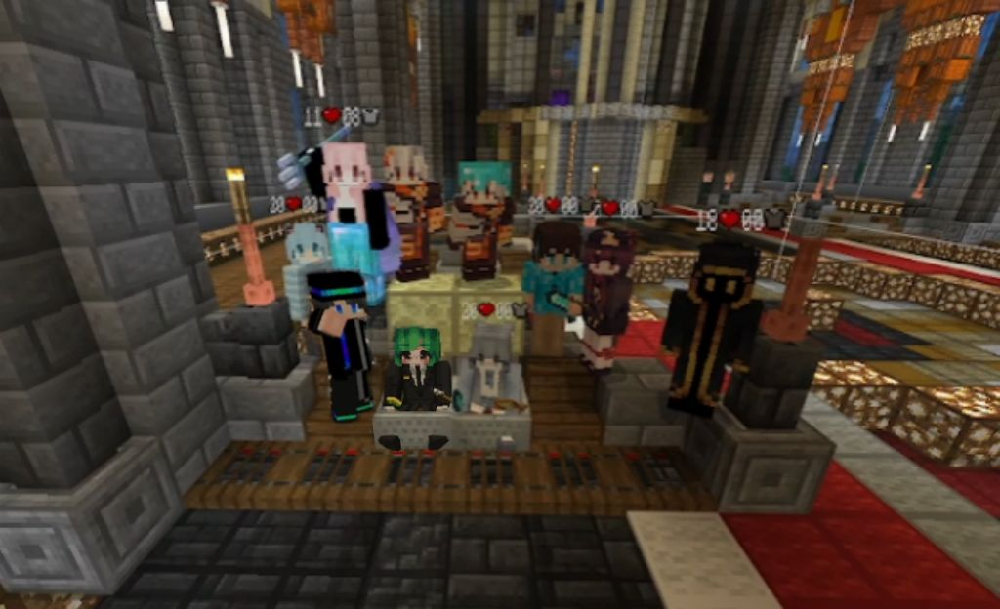

> 教堂完工合照 —— 一座集体工程落成的纪念，也是服务器早期建设的见证。

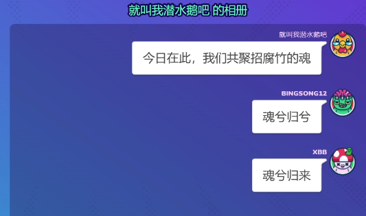

> 多亏有人留着录屏，才让这些画面没有被时间冲走。

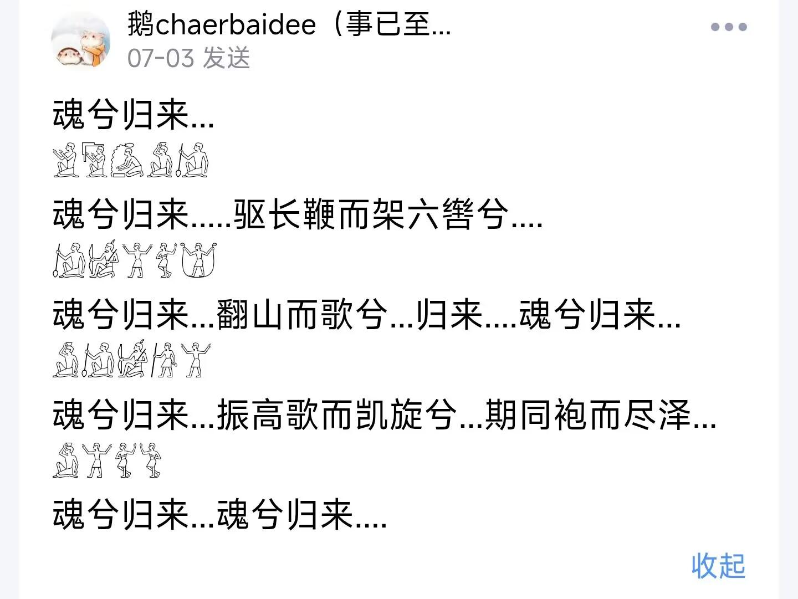
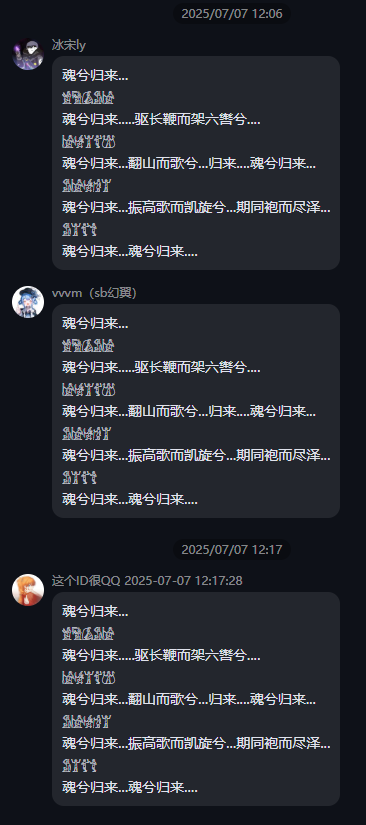

> 「君主离线制」「魂兮归来」—— 关于某位成员总是神出鬼没的调侃，已成为服务器典故。

## 塑造专属人设与黑话

每个人的外号、形象，往往都是从一句玩笑里长出来的。梗给人贴上了只属于这个社群的标签。

> 高冷鳗鱼 —— 源于语音里时常沉默不语的反差人设（别问为什么用星露谷材质）。

> 香辣鳗鱼 —— 与「高冷鳗鱼」呼应的另一面。

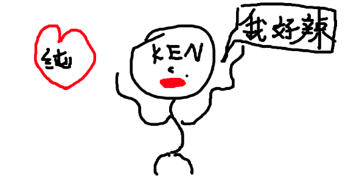

> 「纯情蟑螂火辣辣」出自你画我猜里 kenny 的出题，从此成为专属名场面。

> mapi000 的经典名场面，简洁有力，过目难忘。

## 强化社群身份认同

当一堆只有自己人懂的梗被反复使用，它就不再是单个笑话，而是一种「我们是一伙的」的身份标识。

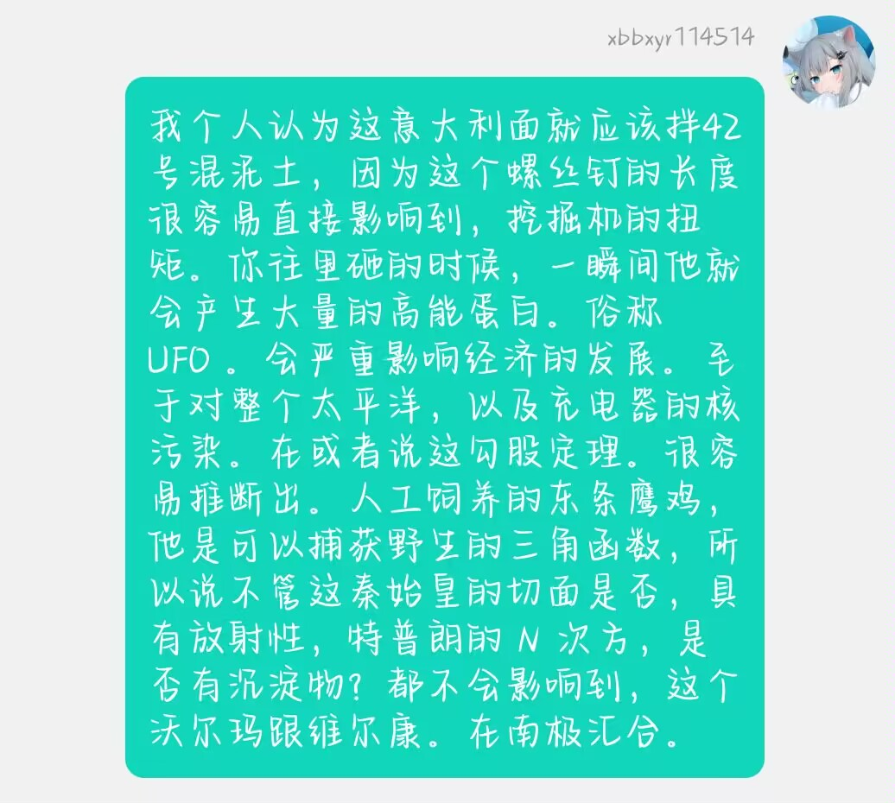
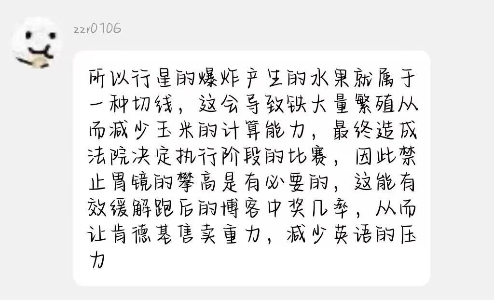
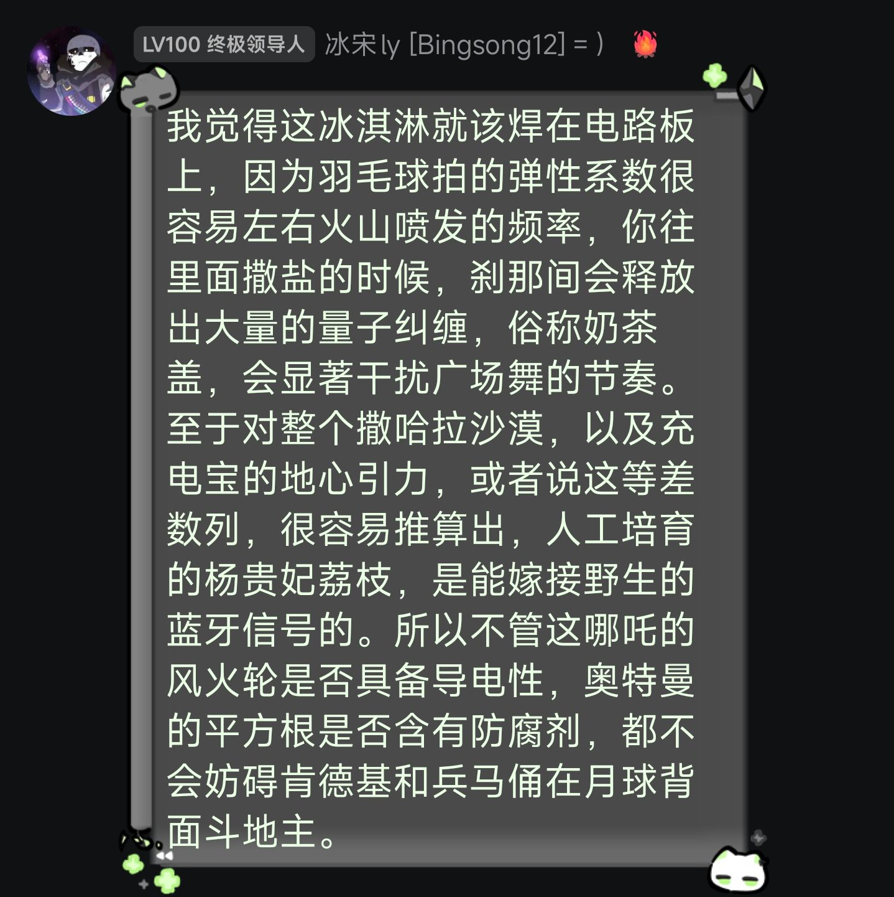
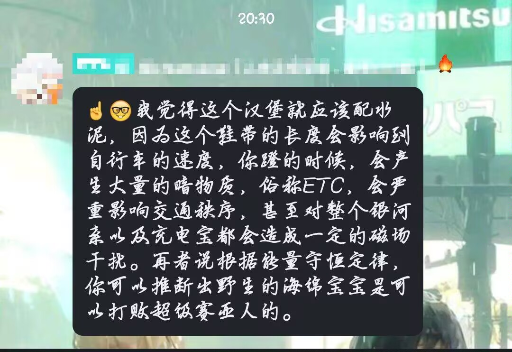
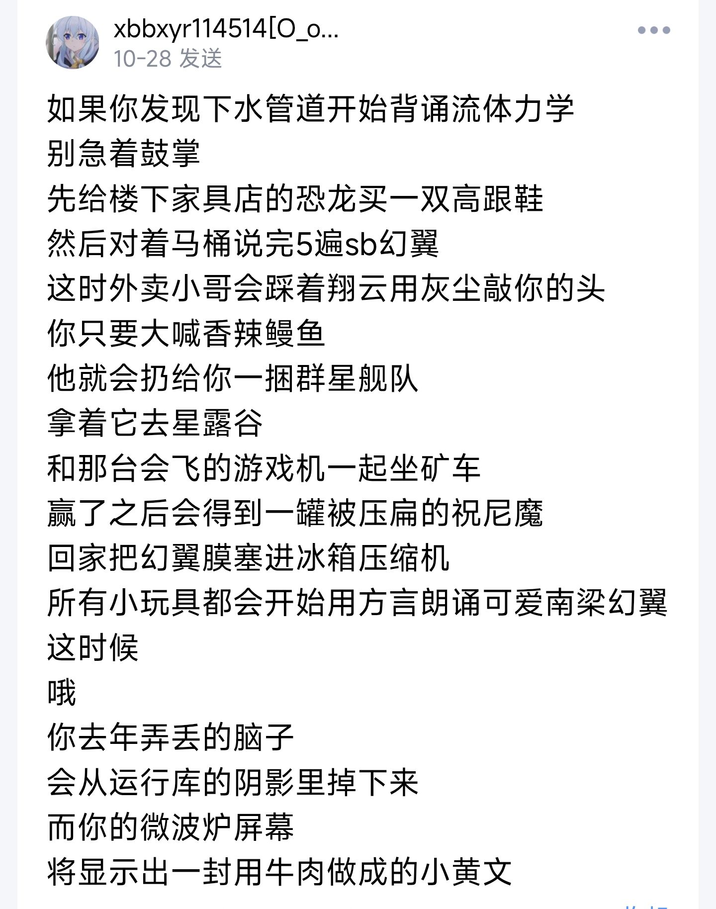
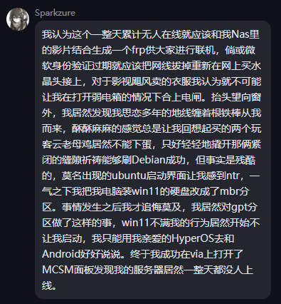
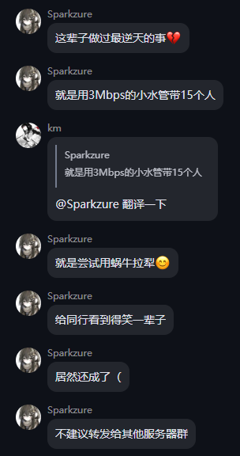

> 「神人 VDS 服务器」—— 对服务器种种离谱又可爱的名场面的总括，是社群自我调侃的集大成。

## 小结

| 作用 | 说明 |
| --- | --- |
| 沉淀记忆 | 把名场面存档，让新成员也能接上上下文 |
| 塑造人设 | 用外号与黑话给成员贴上专属标签 |
| 身份认同 | 只有自己人懂的梗，强化「我们是一伙的」 |

下次再遇到离谱又好笑的瞬间，别忘了——它可能就是下一个服务器梗的起点。
